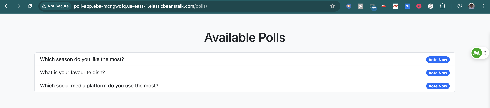
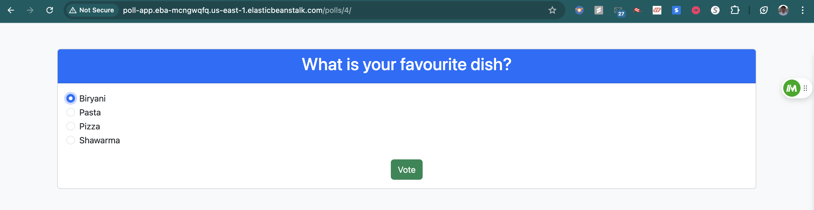
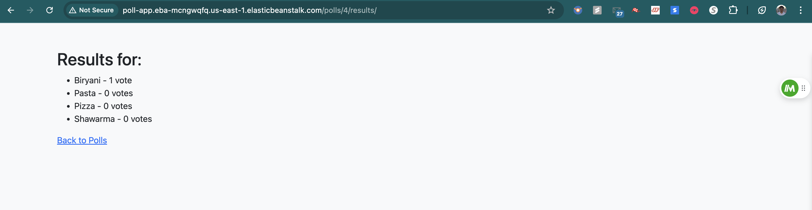

# Mini Poll App
[](https://coveralls.io/github/arsalananwar11/Poll-App?branch=main)

The **Mini Poll App** is a simple polling web application built using the **Django** framework as part of the **Assignment 1** of **CS-GY 6063: Software Engineering 1** course. It allows users to create, list, and vote on polls. This project serves as an introduction to Django's fundamental concepts such as views, templates, models, and forms.

Hosted Application Link: http://poll-app.eba-mcngwqfq.us-east-1.elasticbeanstalk.com/polls/

---

## Table of Contents
1. [Features](#features): Highlights the functionality of the application.
2. [Technologies](#technologies): Lists the technologies used to build the app.
3. [Installation](#installation): Detailed installation steps for setting up the app locally, including creating a virtual environment and running the Django development server.
4. [Folder Structure](#folder-structure): Explains the structure of the project, with brief descriptions of key files and directories.
5. [App Snippets](#screenshots): Placeholders for screenshots to visually showcase the app.

---

## Features
- List all available polls.
- Vote on individual polls.
- View poll results after voting.
- Responsive user interface using Bootstrap.

---

## Technologies
The Mini Poll App is built with the following technologies:
- **Django**: Python web framework for rapid development.
- **Bootstrap**: Front-end framework for responsive design.
- **SQLite**: Default Django database used for quick setup and development.
  
---

## Installation
### Prerequisites
Make sure you have the following installed on your system:
- Python 3.9 or higher

### Step-by-Step Installation
1. **Clone the repository**:
   ```bash
   git clone https://github.com/your-repo/mini-poll-app.git
   cd mini-poll-app
    ```
2. **Create a virtual environment**:
    ```
    python3 -m venv venv
    ```
3. **Activate the virtual environment**:

    - On Mac/Linux:
        ```bash
        source venv/bin/activate
        ```
    - On Windows:
        ```
        venv\Scripts\activate
        ```

4. **Install the required dependencies**:
    ```bash
    pip install -r requirements.txt
    ```

5. **Migrate the database**:
    ```bash
    python3 manage.py migrate
    ```

6. **Run the development server**:
    ```bash
    python manage.py runserver
    ```

Open the application: Visit http://127.0.0.1:8000/polls/ in your browser.

## Folder Structure
Here's a breakdown of the app's folder structure:
```php
poll-app/
│
├── myproject/                 # Main Django project folder
│   ├── __init__.py
│   ├── asgi.py                    # ASGI config
│   ├── settings.py                # Project settings
│   ├── urls.py                    # Project URL routing
│   ├── wsgi.py                    # WSGI config
│
├── polls/                         # Polls app folder
│   ├── migrations/                # Database migrations
│   ├── static/                    # Static files (CSS, JS, images)
│   ├── templates/                 # HTML templates for the app
│   │   ├── polls/                 # Polls specific templates
│   │       ├── index.html         # Template for listing all polls
│   │       ├── detail.html        # Template for viewing poll details and voting
│   │       ├── results.html       # Template for showing poll results
│   ├── __init__.py                # Python package initialization file
│   ├── admin.py                   # Admin panel configuration for polls
│   ├── apps.py                    # Polls app configuration
│   ├── models.py                  # Polls app models (Question, Choice)
│   ├── tests.py                   # Unit tests for the app
│   ├── urls.py                    # URL routing for polls app
│   └── views.py                   # Views for rendering templates
│
├── db.sqlite3                     # SQLite database file
├── manage.py                      # Django's command-line utility
├── README.md                      # This README file
└── requirements.txt               # List of dependencies
```

## Screenshots
- #### Poll List Page
    

- #### Poll Detail and Voting Page
    

- #### Poll Results Page
    